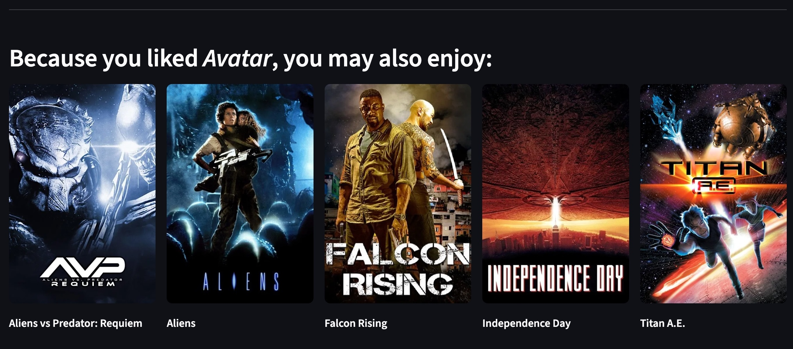

# 🎬 Movie Recommender System

A content-based Movie Recommender System that suggests top 5 similar movies based on your favorite pick, leveraging NLP and cosine similarity. Built with Python, scikit-learn, and deployed using Streamlit on Render.

---

## 🖼️ Screenshots

### 🏠 Website Home


### 🎥 Avatar Recommendation



### 🕷️ Spider Man Recommendation


---

## 📌 Table of Contents

- [Overview](#overview)
- [Problem Statement](#problem-statement)
- [Solution Approach](#solution-approach)
- [Tech Stack](#tech-stack)
- [Demo](#demo)
- [Setup & Installation](#setup--installation)
- [How It Works](#how-it-works)
- [Future Enhancements](#future-enhancements)

---

## 🚀 Overview

In the age of endless movie choices, decision fatigue is real. This project solves that problem by recommending movies similar to the one you like, using a custom NLP pipeline that creates a content-based similarity matrix.

---

## ❓ Problem Statement

Users often struggle to pick their next movie. Generic lists don’t adapt to unique tastes. This system empowers users to find new titles aligned with their preferences, using metadata such as genres, keywords, cast, crew, and plot overview.

---

## 🧩 Solution Approach

**1. Data Preparation**

- Datasets: `tmdb_5000_movies.csv` and `tmdb_5000_credits.csv` from The Movie Database (TMDB).
- Merged datasets on `title` to unify movie metadata.

**2. Feature Engineering**

- Selected relevant features: `genres`, `keywords`, `cast` (top 3 actors), `crew` (director only), and `overview`.
- Cleaned nested JSON fields using `ast.literal_eval`.
- Normalized text data: removed spaces in multi-word tokens, combined all features into a single `tags` column.

**3. NLP Pipeline**

- Stemming applied using `PorterStemmer`.
- Converted text to lowercase.
- Vectorized text data with `CountVectorizer` (5000 max features, English stopwords removed).

**4. Similarity Matrix**

- Calculated pairwise cosine similarity.
- Stored results using `pickle` for production use.

**5. Frontend & Deployment**

- **Streamlit** app with an interactive dropdown.
- Fetches movie posters dynamically from TMDB API.
- Deployed seamlessly on **Render** for public access.

---

## ⚙️ Tech Stack

| Layer               | Technology                               |
|---------------------|------------------------------------------|
| Data Processing     | Python, pandas, numpy                    |
| NLP & ML            | scikit-learn, NLTK                       |
| Web App Framework   | Streamlit                                |
| Deployment          | Render.com                               |
| Data Source         | TMDB 5000 Movies & Credits Dataset       |
| API Integration     | The Movie Database (TMDB) Poster API     |

---

## 📽️ Demo

👉 [**Try the Live Demo on Render**](https://movie-recommender-system-yashkalra27.onrender.com/)

---

## 📥 Setup & Installation

1. **Clone the repository**

   ```bash
   git clone https://github.com/YashKalra27/Movie-Recom-System.git
   cd movie-recommender-system

2.	**Create virtual environment (recommended)**
   
   ```bash
   python -m venv venv
   source venv/bin/activate (Mac)
   # On Windows: venv\Scripts\activate3.
   ```

3. **Install dependencies**
   
   ```bash
   pip install -r requirements.txt
   ```
   
4. **Run locally**
   
   ```bash
   streamlit run app.py
   ```
   
---

## 🔍 How It Works

1. User selects a movie title from the dropdown menu.
2. The app finds that movie’s index in the dataset.
3. It computes similarity scores using the precomputed cosine similarity matrix.
4. It retrieves the top 5 most similar movies.
5. Posters for these movies are fetched dynamically using the TMDB API.
6. The recommended movie titles and posters are displayed in a neat layout.

This entire flow happens in real-time on your deployed Streamlit app.

---

## 📈 Future Enhancements

- 🔄 Combine content-based filtering with collaborative filtering for hybrid recommendations.
- 🔐 Add user authentication and preference saving for personalized lists.
- ⭐ Integrate user ratings and reviews for more context-aware suggestions.
- 📱 Develop a mobile-friendly interface for better accessibility.
- 🐳 Package the app using Docker for easier deployment on any cloud provider.
